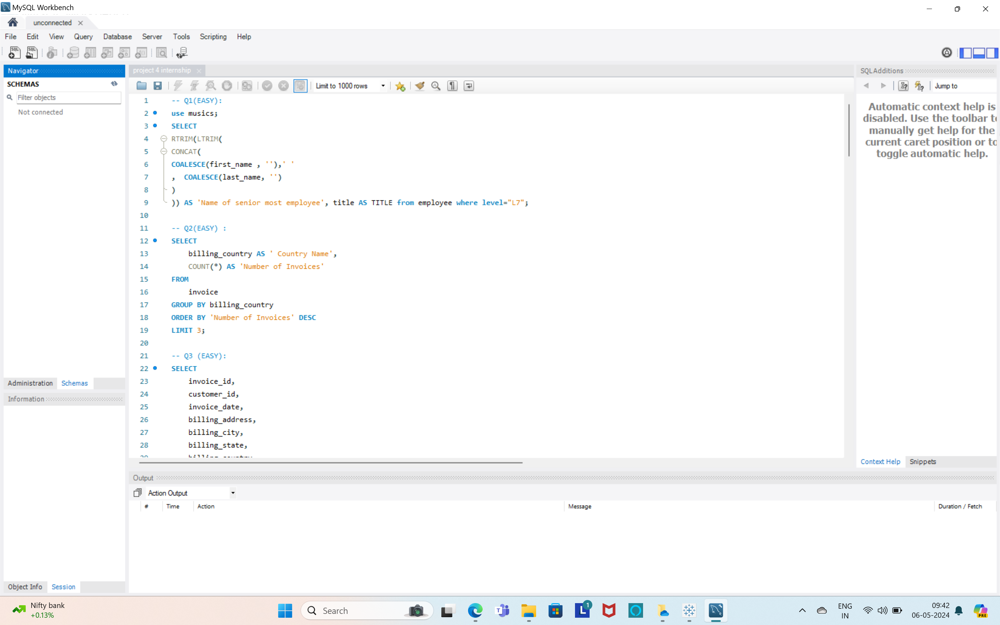
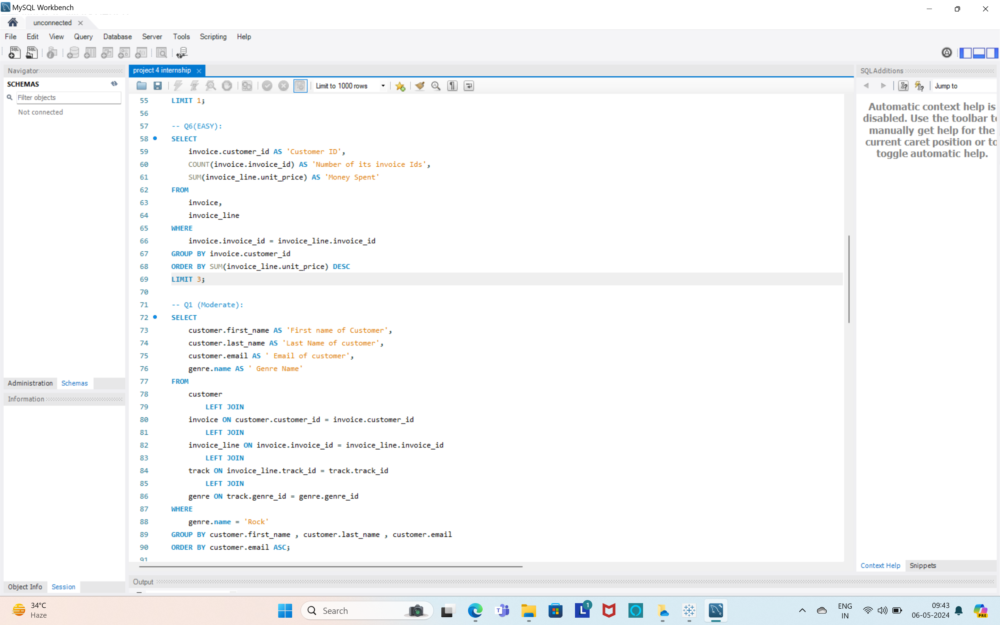
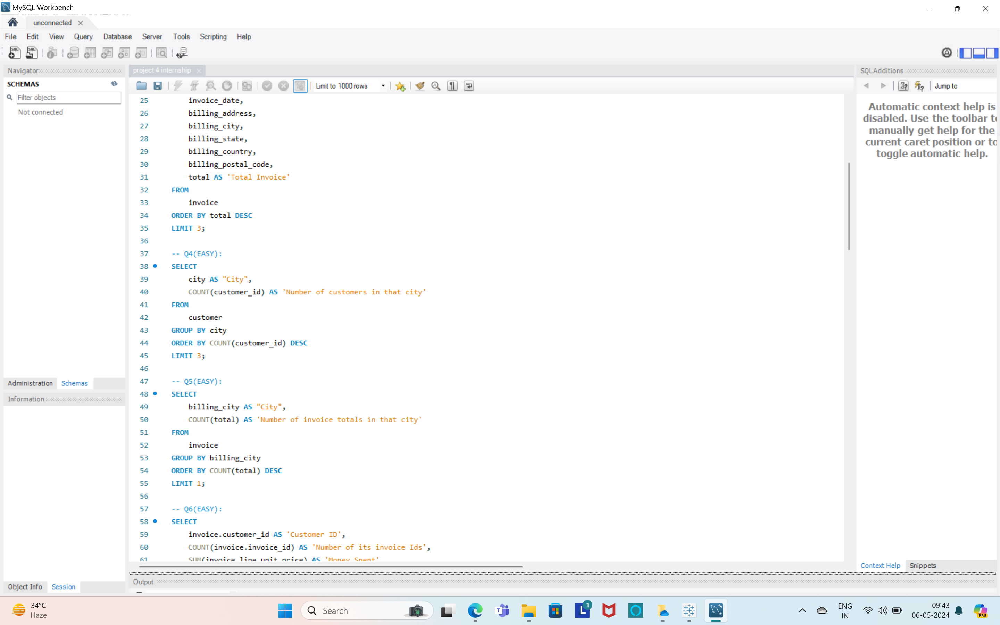
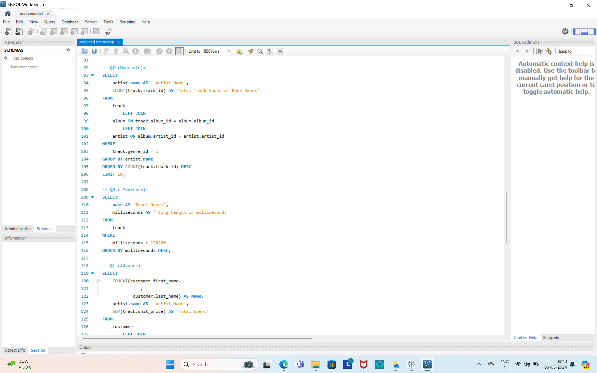
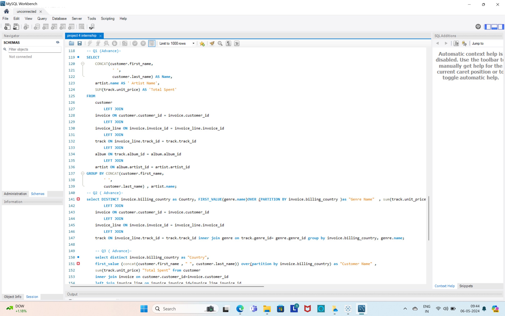
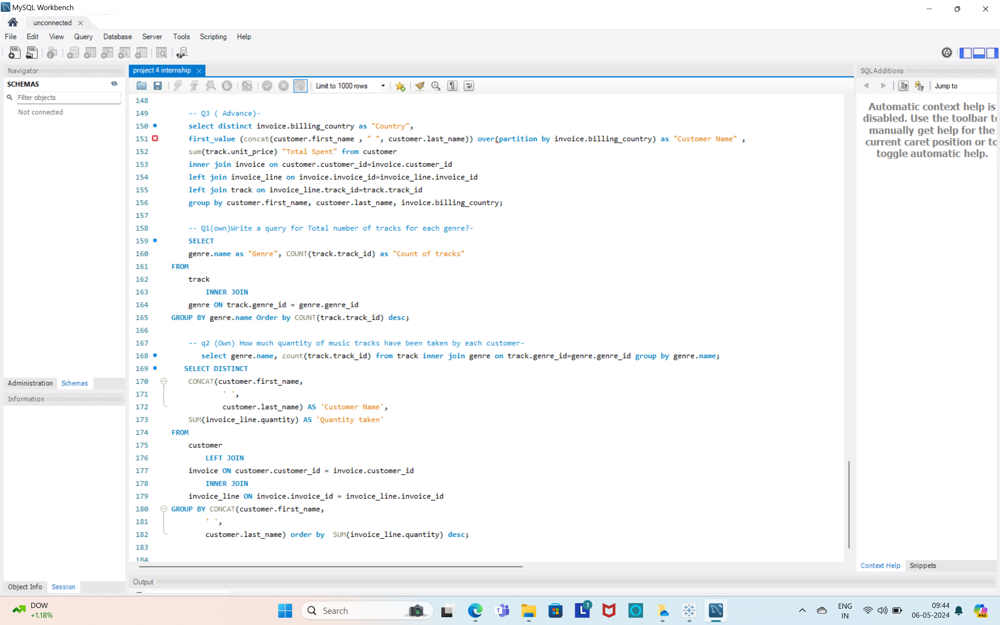

# MusicDataAnalysis-SQL

## Introduction
Welcome to the Music Data Analysis SQL project! This project aims to analyze and extract insights from a music dataset using SQL queries. By leveraging SQL, we can efficiently retrieve, manipulate, and analyze various aspects of music data, including artist information, song details, album tracks, user interactions, and more.

## Dataset Description
The dataset used in this project contains the following tables:
Artists: Contains information about music artists, including artist ID, name, genre, and nationality.
Albums: Stores details of music albums, including album ID, title, release year, and artist ID.
Tracks: Represents individual tracks within albums, including track ID, title, duration, and album ID.
Users: Provides information about users interacting with the music platform, including user ID, username, and registration date.
Listening History: Logs user interactions with tracks, including play timestamps, track IDs, and user IDs.
## Features
1. Artist Analysis
Retrieve information about specific artists, including their genre, nationality, and discography.
Analyze the popularity and distribution of artists across different genres or regions.
2. Album Analysis
Explore details of music albums, including their titles, release years, and tracklists.
Identify top-selling albums or albums with the highest listener engagement.
3. Track Analysis
Analyze individual tracks, including their durations, popularity, and listener engagement.
Identify trends in track popularity over time or across different user demographics.
4. User Interaction Analysis
Investigate user interactions with tracks, including play counts, timestamps, and user preferences.
Analyze user engagement metrics, such as average play time per session or frequency of interactions.
## Analysis
1. Right Click on schema side and then click create schema and type name of it as “musics” and click apply.
2. After creation of schema, we will create table.
3. Right click under schema musics and click create table and name the first table as “album”.
4. There are 3 columns of it so we will create them and click not null to get the data of that type only. 3 columns are named as album_id, title and artist_id.
5. Now select album table as “SELECT * FROM album; “.
6. Now copy the table of album from excel and paste it in album table is SQL by right clicking on it under table and then click apply to apply the changes.
7. Similarly create table artist, customer, employee, genre, invoice, invoice_line, media, playlist, playlist_track and track.
8. Create columns under these tables according to information in seen in excel.
9. After creation of columns select these tables in SQL one by one.
10. Copy paste the tables accordingly from excel and complete the tables.
11. First question is “Who is the senior most employee based on job title”.
12. Second question is “Which countries have the most Invoices”.
13. 3rd question is “What are top 3 values of total invoice”. 
14. 4th question is “Which city has the best customers? We would like to throw a promotional Music”. 
15. 5th question is “Festival in the city we made the most money. Write a query that returns one city that has the highest sum of invoice totals. Return both the city name & sum of all invoice totals”. 
16. 6th question is “Who is the best customer? The customer who has spent the most money will be declared the best customer. Write a query that returns the person who has spent the most money”.
17. 1st question of this part is “ Write query to return the email, first name, last name, & Genre of all Rock Music listeners. Return your list ordered alphabetically by email starting with A”. 
18. 2nd Question is “ Let's invite the artists who have written the most rock music in our dataset. Write a query that returns the Artist name and total track count of the top 10 rock bands”. 
19. 3rd Question is “ Return all the track names that have a song length longer than the average song length. Return the Name and Milliseconds for each track. Order by the song length with the longest songs listed first”.
20. 1st question in this set is “Find how much amount spent by each customer on artists? Write a query to returncustomer name, artist name and total spent”. 
21. 2nd question is “ We want to find out the most popular music Genre for each country. We determine the most popular genre as the genre with the highest amount of purchases. Write a query that returns each country along with the top Genre. For countries where the maximum number of purchases is shared return all Genres”.
22. 3rd question is “Write a query that determines the customer that has spent the most on music for each country. Write a query that returns the country along with the top customer and how much they spent. For countries where the top amount spent is shared, provide all customers who spent this amount”.
23. First question made by me “How much quantity of music tracks have been taken by each customer”. 
24. Second question made by me “Write a query for Total number of tracks for each genre?”. 

